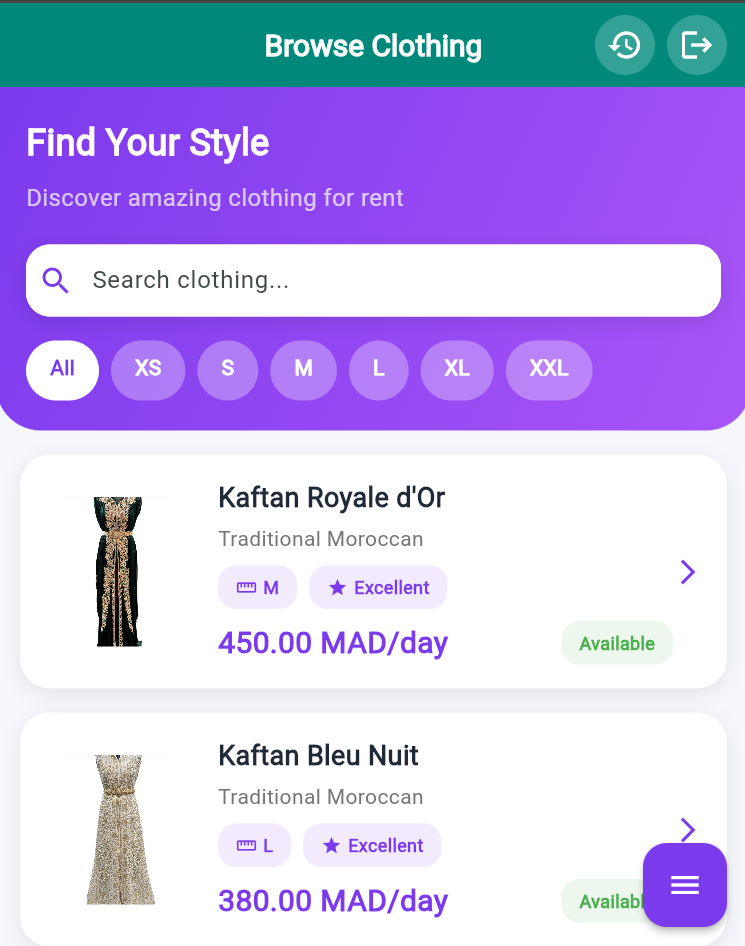
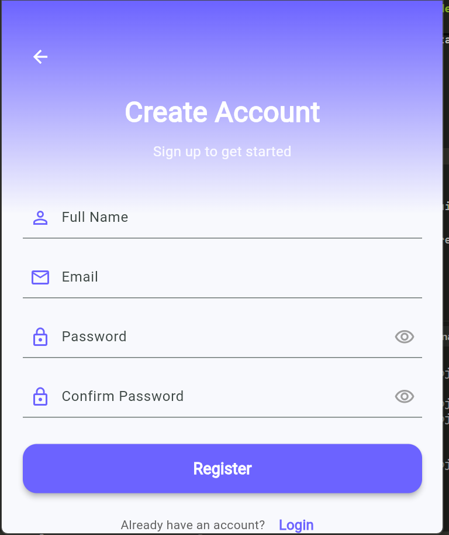
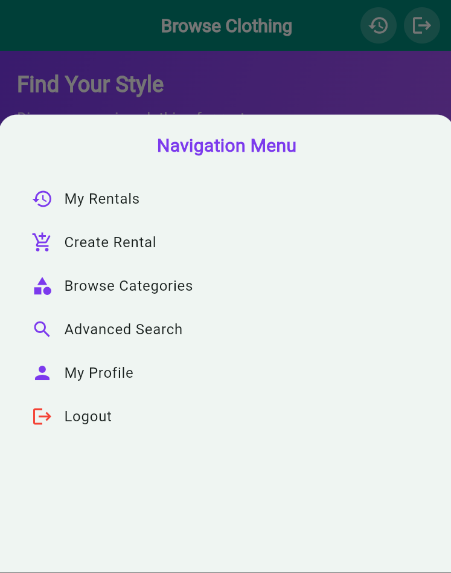
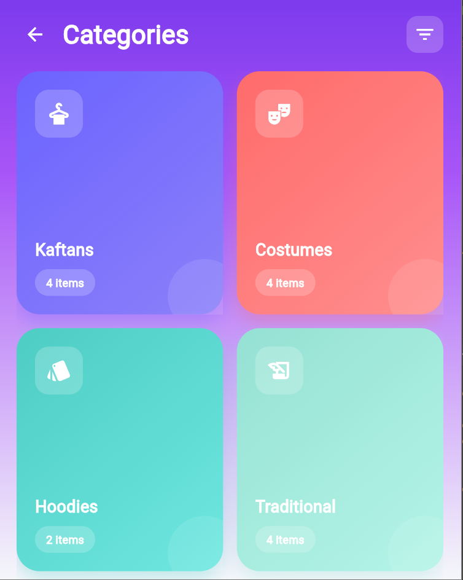
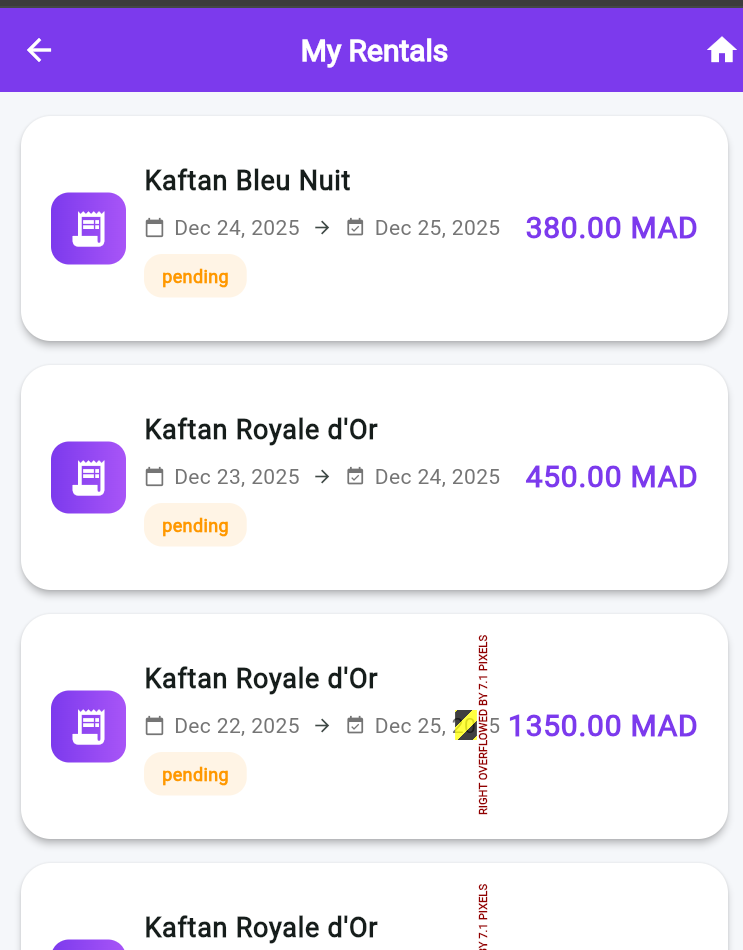
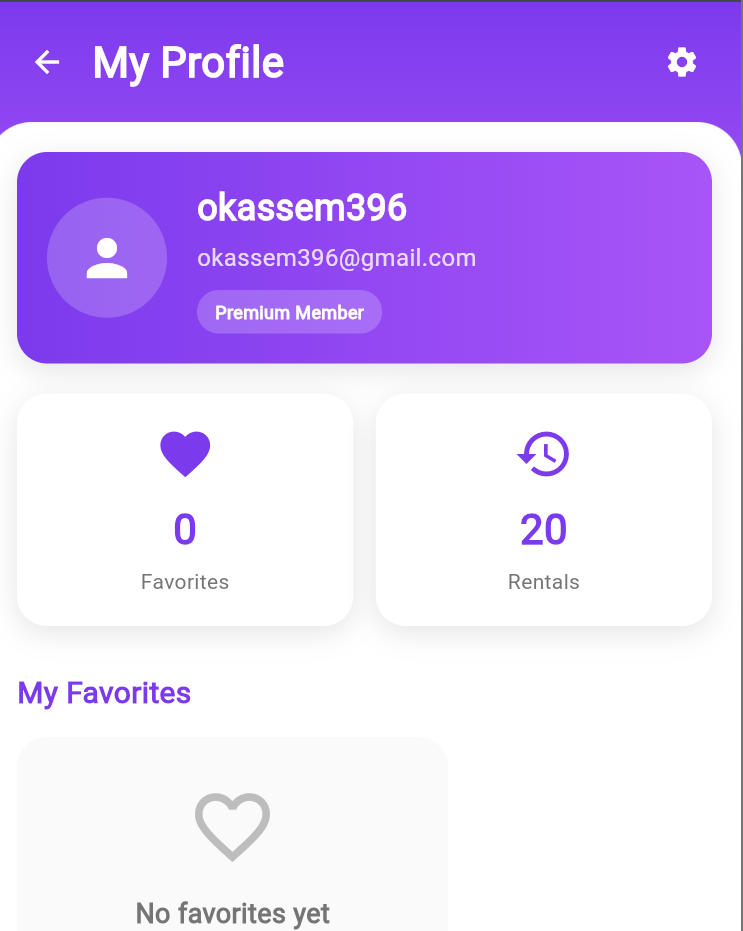

# Mowdaav Rentals - Location de Vêtements en Ligne

## 📱 Contexte du Projet
Mowdaav Rentals est une application mobile de location de vêtements traditionnels et modernes. La plateforme permet aux utilisateurs de louer des vêtements pour des occasions spéciales, des événements ou un usage quotidien, offrant une alternative économique et écologique à l'achat de vêtements.

## 🎯 Objectifs du Projet
- Créer une plateforme de location de vêtements accessible et conviviale
- Faciliter la découverte et la location de vêtements traditionnels
- Offrir une expérience utilisateur fluide et intuitive
- Gérer efficacement les réservations et les retours de vêtements

## 🏗 Architecture du Projet
Le projet suit une architecture client-serveur avec :

### Frontend (Application Mobile)
- **Framework**: Flutter
- **Langage**: Dart
- **Architecture**: BLoC (Business Logic Component)
- **Gestion d'état**: Provider

### Backend (API)
- **Framework**: Laravel
- **Base de données**: MySQL
- **Authentification**: Laravel Sanctum
- **API RESTful**

## 🛠 Technologies Utilisées

### Frontend
- **Flutter** - Framework de développement d'applications mobiles
- **Dart** - Langage de programmation
- **Provider** - Gestion d'état
- **http** - Pour les appels API
- **intl** - Pour la gestion des dates et l'internationalisation
- **shared_preferences** - Pour le stockage local

### Backend
- **Laravel** - Framework PHP
- **MySQL** - Base de données relationnelle
- **Laravel Sanctum** - Authentification API
- **Eloquent ORM** - Gestion des modèles de données
- **Migrations** - Gestion du schéma de base de données

## 📂 Structure du Projet
```
Mowdaav_Rentals/
├── frontend/           # Application Flutter
│   └── clothing-app/
│       ├── lib/        # Code source Dart
│       ├── assets/     # Images et ressources
│       └── pubspec.yaml # Dépendances Flutter
└── backend/            # API Laravel
    └── laravel-api/
        ├── app/        # Logique métier
        ├── database/   # Migrations et seeders
        ├── routes/     # Définition des routes API
        └── .env        # Configuration
```

## 🚀 Configuration et Installation

### Prérequis
- Flutter SDK
- Dart SDK
- PHP 8.1+
- Composer
- MySQL
- Node.js & npm

### Installation du Backend
```bash
cd backend/laravel-api
cp .env.example .env
composer install
php artisan key:generate
php artisan migrate --seed
php artisan serve
```

### Installation du Frontend
```bash
cd frontend/clothing-app
flutter pub get
flutter run
```

## 📱 Fonctionnalités
- Inscription et authentification des utilisateurs
- Parcours du catalogue de vêtements
- Filtrage par catégories et tailles
- Système de réservation
- Gestion du panier
- Suivi des commandes
- Profil utilisateur

## 📸 Captures d'écran

| Écran | Capture |
|-------|---------|
| **Écran d'accueil** |  |
| **Connexion** |  |
| **Inscription** |  |
| **Menu** |  |
| **Catégories** |  |
| **Mes locations** |  |
| **Profil** |  |
## 🔧 Développement
Pour contribuer au projet, veuillez suivre ces étapes :
1. Fork le dépôt
2. Créez une branche pour votre fonctionnalité
3. Committez vos changements
4. Poussez vers la branche
5. Créez une Pull Request

## 📝 Licence
Ce projet est sous licence MIT.

## 👥 Auteurs
- Oussama Kassem  (MowdaavAIRevolution)


---

*Dernière mise à jour : Janvier 2026*
